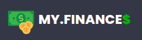
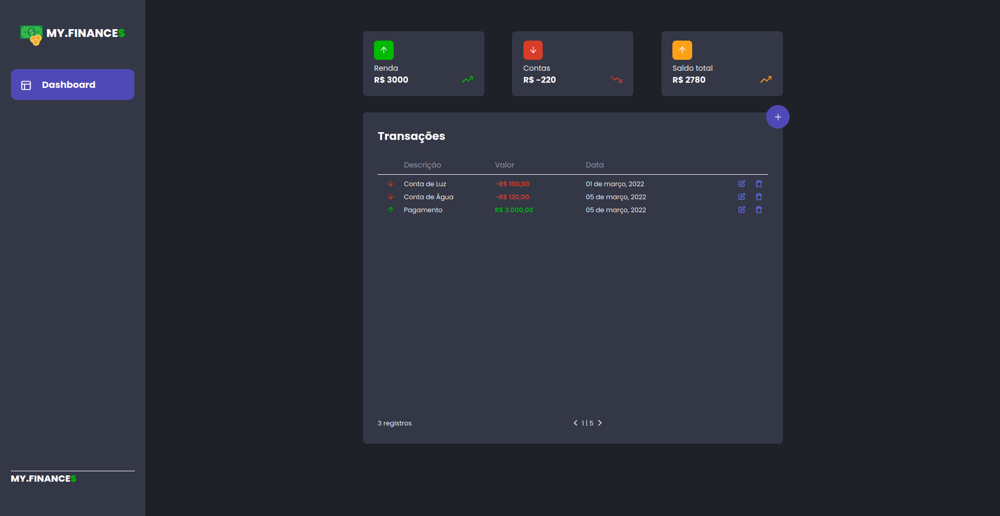

<br>

## ✨ Tecnologias

Esse projeto foi desenvolvido com as seguintes tecnologias:

- [React](https://reactjs.org)
- [TypeScript](https://www.typescriptlang.org/)

## 💻 Projeto

O MyFinances é um app para controle de finanças.

## 🔖 Layout



## 🚀 Como executar

Clone o projeto e acesse a pasta

```bash
# Clone o projeto
$ git clone https://github.com/caarloseduardo/myfinances.git
# Acesse a pasta do projeto
$ cd myfinances
```

Após isso, siga os seguintes passos

```bash
# Instale as dependências
$ yarn
# Inicie o projeto
$ yarn dev
```

Agora você pode acessar [`localhost:3000`](http://localhost:3000) do seu navegador.

<br>

## ⚙️ Back-end
Você pode ver o back-end da aplicação no seguinte repositório: https://github.com/caarloseduardo/myfinances-api
